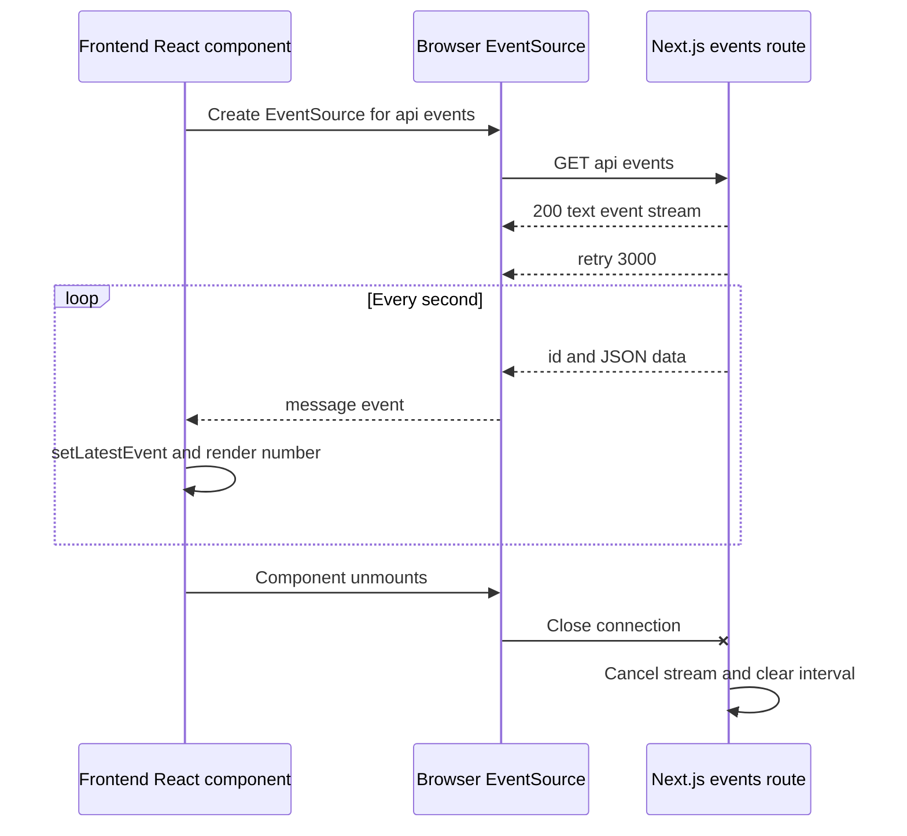

# Server-Sent Events with Next.js

A small SSE example focused on the frontend mental model. The page opens one persistent connection to a Next.js route handler and renders a new random number whenever the server sends an event.

## Run it

```bash
pnpm install
pnpm dev
```

Open [http://localhost:3000](http://localhost:3000).

## What SSE is

Server-Sent Events is a browser API for one-way, server-to-browser updates over HTTP.

1. The browser calls `new EventSource('/api/events')`.
2. That creates one long-lived `GET /api/events` request.
3. The server responds with `Content-Type: text/event-stream` and keeps the response open.
4. Each blank-line-terminated SSE message becomes a browser `message` event.
5. The UI updates from that event callback; it does not poll the server.

`EventSource` reconnects automatically after a connection drops. The backend sends `retry: 3000` to suggest a three-second retry delay.

SSE is server-to-client only. Use `fetch`, a form submission, or another HTTP request when the browser needs to send data back to the server. For full two-way persistent messaging, use WebSockets instead.

## Advantages and disadvantages

### Advantages

- **Simplicity:** the browser provides `EventSource`, and the server only needs to return a streaming HTTP response using `text/event-stream`.
- **Easy to scale:** SSE uses standard HTTP infrastructure, so it can fit naturally behind existing servers, proxies, and load balancers that support streaming.
- **Low overhead:** one persistent connection replaces repeated polling requests, reducing repeated request headers and connection setup.
- **Good for real-time applications:** it is well suited to server-to-UI updates such as notifications, dashboards, job progress, logs, and AI output.
- **Automatic reconnection:** when a connection drops, `EventSource` retries automatically; the server can suggest the retry delay with `retry`.
- **Low latency:** the server can send an event as soon as new data exists instead of waiting for the browser’s next polling interval.

### Disadvantages

- **Unidirectional:** data flows from server to browser only. Send browser actions with `fetch`, or use WebSockets when both sides need a persistent messaging channel.
- **Text only:** SSE frames are text, so objects must be serialized, usually as JSON, then parsed by the frontend.

## Frontend and backend communication



## This implementation

### Backend: `src/app/api/events/route.ts`

The Next.js route handler creates a `ReadableStream` and returns it as the response body. It sends one JSON payload immediately and a fresh random number every second.

Each event follows the SSE wire format:

```text
id: 1
data: {"randomNumber":42,"serverTime":"2026-09-19T12:00:00.000Z"}

```

The final blank line is important: it tells the browser that the event is complete. When the browser closes the connection, the stream's `cancel` callback clears the interval so the server stops producing values.

### Frontend: `src/app/page.tsx`

The component creates `EventSource` in `useEffect`, which is where it synchronizes React with the external browser connection.

- `onopen` marks the connection as `online`.
- `onmessage` parses a server payload and stores it in React state.
- `onerror` shows whether the browser is reconnecting or closed.
- The effect cleanup calls `source.close()` when the page component unmounts.

React state is updated inside the EventSource callbacks, not synchronously in the effect body. That avoids cascading renders and mirrors the actual event-driven lifecycle.

## Useful experiments

- Change `setInterval(send, 1000)` to a different interval.
- Stop and restart `pnpm dev` to see automatic reconnection.
- Add an `event: custom-name` line on the server and receive it with `source.addEventListener('custom-name', handler)` on the client.
- Open the browser DevTools Network panel and inspect the open `/api/events` request.
