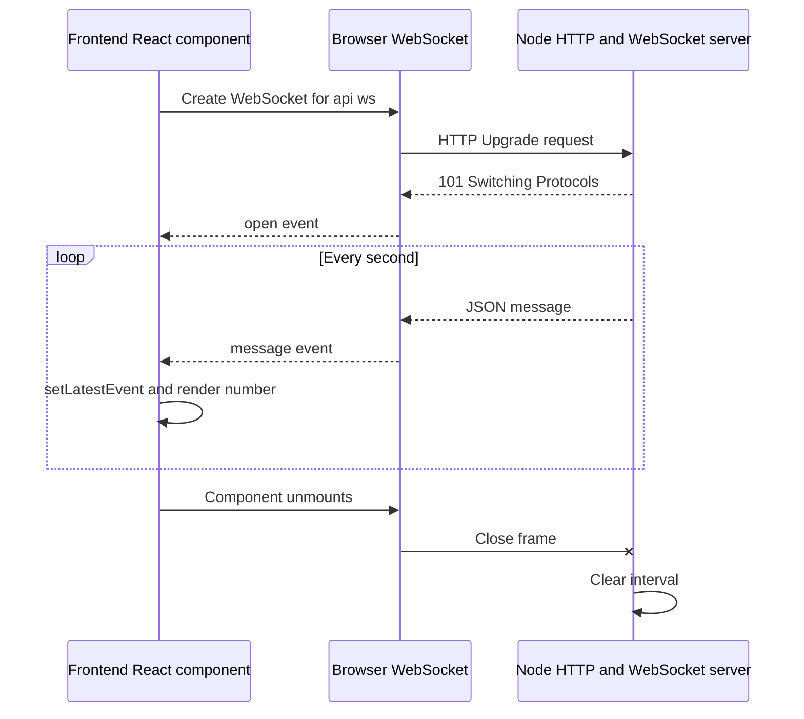

# WebSockets with Next.js

A small WebSocket example focused on the frontend mental model. The page opens one persistent, two-way connection to a Node server and renders a new random number whenever the server sends a message.

## Run it

```bash
pnpm install
pnpm dev
```

Open [http://localhost:3000](http://localhost:3000).

## What WebSockets are

WebSockets provide a persistent, full-duplex connection between browser and server.

1. The browser calls `new WebSocket('ws://localhost:3000/api/ws')`.
2. The browser begins with an HTTP request containing an `Upgrade: websocket` header.
3. The Node server accepts that upgrade and keeps a WebSocket connection open.
4. Either side can send messages whenever it needs to; this example sends a random number from server to browser every second, and accepts a message from the browser.
5. The UI updates from the socket `message` callback; it does not poll the server.

The browser WebSocket API does **not** reconnect automatically. Production applications should choose and implement a reconnection policy, then consider message IDs or acknowledgements when missed messages matter.

## Advantages and disadvantages

### Advantages

- **Two-way messaging:** browser and server can both send messages over the same persistent connection.
- **Low latency:** a message can be delivered as soon as it exists, without polling.
- **Binary support:** WebSockets can send text and binary frames.
- **Good for interaction:** they fit chat, multiplayer games, collaborative editing, presence, and real-time control surfaces.

### Disadvantages

- **More lifecycle work:** reconnects, heartbeats, resuming missed messages, and flow control are application responsibilities.
- **Stateful scaling:** load balancers and horizontally scaled servers need to route connections and distribute events deliberately.
- **Custom-server requirement here:** Next.js route handlers work well for HTTP/SSE streams, but accepting upgrade connections requires access to the Node HTTP server. This example uses a small custom server and `ws` for that upgrade.

## Frontend and backend communication



## This implementation

### Backend: `server.ts`

The custom Node server starts Next.js for normal requests, then handles only upgrades to `/api/ws`. The `ws` package creates a WebSocket server without its own HTTP server and receives the accepted upgrade. Each connection receives one JSON payload immediately and a fresh random number every second. When it receives a valid browser message, it sends an acknowledgement back over that same socket. When the client closes, the server clears that connection's interval.

### Frontend: `src/app/page.tsx`

The component creates `WebSocket` in `useEffect`, which synchronizes React with the external browser connection.

- `onopen` marks the connection as `online`.
- `onmessage` validates and stores a JSON server payload in React state.
- `onclose` and `onerror` mark the connection as `closed`.
- The effect cleanup closes the socket when the page component unmounts.

The form sends `{ type: 'message', message: '...' }`. The server validates that JSON and responds with either an acknowledgement or a validation error, making the two-way flow visible without adding a second API endpoint.

React state is updated inside the WebSocket callbacks, not synchronously in the effect body. That avoids cascading renders and mirrors the actual event-driven lifecycle.

## Useful experiments

- Change `setInterval(send, 1000)` in `server.ts` to a different interval.
- Stop and restart `pnpm dev`: unlike SSE, this page stays closed until you implement reconnection.
- Add `socket.on('message', handler)` in `server.ts`, then call `socket.send(...)` from the browser to see full-duplex messaging.
- Open DevTools Network and inspect the `/api/ws` request: it begins as HTTP and is upgraded to a WebSocket connection.
